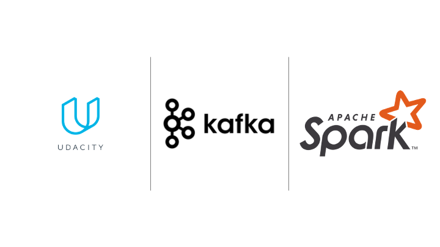
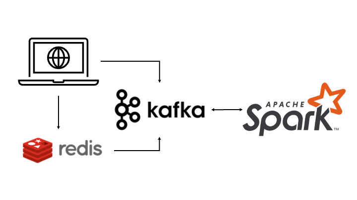

# Data Streaming Nanodegree (Udacity)

Hi everyone :wave: , welcome to the `Data Streaming Nanodegree` repository. This repository contains the projects I have worked on in Data Streaming Nanodegree. I aim to create this repository to be a reference for my work towards data engineering. Also, I will write a review about the course for those who may be interested in taking this course. 

# Project overview

## Optimizing public transportation
This project is part of the `Kafka` learning topic. This project aims to build a streaming data pipeline to subscribe data from the streaming data source and consume it by the web application to show the movement of public transportation.

## What you will do in this project
1. Firstly, you will complete a `Kafka-producer` to simulate data for the application.
2. Then, you will ingest data from different data sources with `Kafka-connect`, and `Kafka-rest-proxy.`
3. After that, you will do some stream processing or the data with `Faust` and `KSQL.`
4. Finally, you will create a `Kafka-consumer` to consume the data and display it in the dashboard.

## Human balance evaluation
This project is part of the `spark` learning topic. The purpose is to read streaming data with `pyspark` and then do the streaming processing and write it back to the `Kafka` application. 

## What you will do in this project
1. Learn how to start the `spark` application by yourself.
2. Read data from `Kafka-topic` with `pyspark`
3. Process data with the following steps
    - decode `base64` data format
    - clean `JSON` format after decoding
    - parse `JSON` format data to `spark dataframe.`
    - leverage both `pyspark` , and `sparksql` API
    - filter data with `sparksql`
    - join data from 2 streaming together
4. Sink transformed data back to the new `Kafka-topic` and plot it in the dashboard.

# What about the Nanodegree
Disclaimer: I take this course with a 75 % off monthly discount (~ 100 USD). Also, I'm familiar with python, SQL, and spark language before taking this course.

## Course contents

### Kafka
- The Kafka course content is very rich. I would say that it's the most detailed content I have ever seen in the Nanodegree (I've taken Data Engineering Nanodegree before this course). 

- The video explanation, example, and mentor's help forum are sufficient for you to pass the project assignment efficiently. 

- It would be a good Kafka reference for me in the future if I have to revisit the `Kafka` project. 

- One minor drawback is that the version of Kafka is not that latest so that some API functions are already deprecated.

### Spark
- The `spark` subject is quite weaker than the `Kafka` subject. It teaches only basic pyspark functions about the io operation, processing, and how to start the development environment by yourself.

- The assignment content is quite dull. You need to rewrite the same thing over and over aging to complete the lecture assignment. The assignment seems like cumulative content from the previous one, which means you need to write the first part of the code more than 20 times. It is good to do something repeatedly to make you better memorization. However, it's a bit boring to do the same thing over and over.

- The drawback of this section is that the development environment is incompleted. Sometimes, you follow the instructions steps, but you can't make the Udacity workspace works as it should be. I spend most of the time fixing the development environment issues.

## Project quality

### Kafka
- At first glance, I feel overwhelmed with the things to do for completing the project assignment. They provide a lot of templates to be filled out. Even if I follow the instruction, it is hard to better understand how things flow in this project. 

- It takes time for me to be familiar with the project structure, but once I'm okay with it. The rest would be the same as you did in the learning lecture. 

- The drawback is that some instructions are pretty ambiguous. For example, they told you to set a new topic name, but they already have a fixed topic to use to make the web application work. 

- It would be a good template for further projects. But I think to better understand the `Kafka`, I need to try replicating the project structure and development environment by myself.

### Spark
- The project is quite simpler compared to the `Kafka` project. Only 3 files you need to complete for delivering the project. 2 of the files are a subset of another one. 

- The hint written in the project doesn't align with the actual data. They may update the input data but didn't update the instruction within the file. Thus, it will require you to debug the code line by line to see what is going wrong.

- The development environment is better than the one in the lecture section. There is no need for you to fix the starting script. However, the instructor didn't provide you a proper step to run the application. Refresh the workspace helps me a lot when I can't figure out what is going wrong.

## Time to complete
It's about the same as the Data Engineering Nanodegree. You can finish the whole course within a month. Also, the lecture material can be accessed 1 year after completion.

## Development environment
Compared to the Data Engineering Nanodegree, I think this course gives you a bad experience about the development environment. There are so many updated scripts, but they didn't deploy to the workspace correctly. So you have to spend time figuring it out by yourself. It gives you frustration sometimes.

# Suammry
Overall, this course is somewhat great. If you have never experienced streaming data or would like to learn about `Kafka`. I would recommend you to take a look at this course. The Nanodegree doesn't provide you an open-end project like the Data Engineering Nanodegree, but you can get a sense of how you can conduct your side project with the streaming data.

In my opinion, taking this course after the Data Engineering Nanodegree is a recommended sequence. You will see a different type of input data, but the way you process the data is quite similar. It's just like an extended version of Data Engineering Nanodegree.